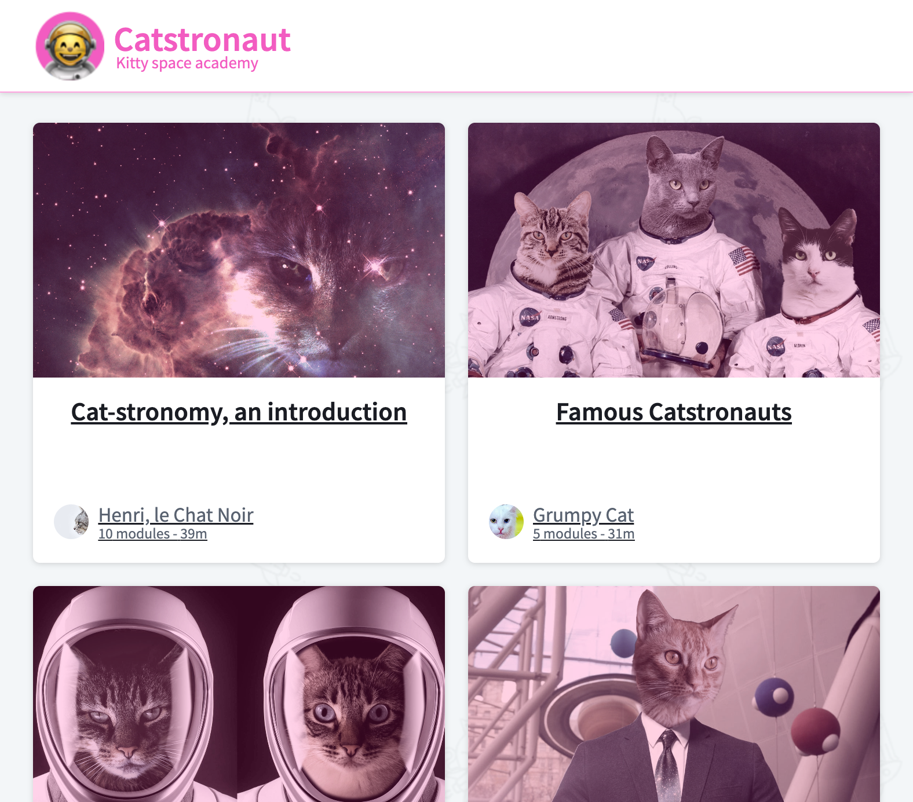
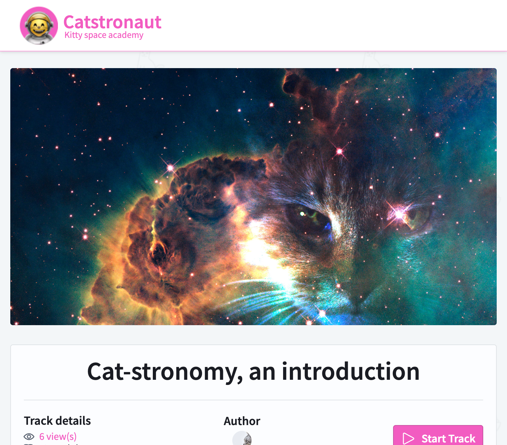

# Catstronaut Course Explorer - GraphQL API

## Description

The client for this project wanted support with reducing the load times that their customers were experiencing. They were using a REST API with fetch for all of their queries, with no results caching.
To remedy this issue, GraphQL was implemented in addition to the REST API. Using RESTDataSource, Apollo Client, and Apollo Server, I implemented much more efficient queries that could also be cached on the client side. This reduced the average API calls per request from 101 to just 2. Response time was reduced from an average 677ms per request to 24ms with caching.

This project was created as part of a Apollo GraphQL certification course to demonstrate my knowledge of GraphQL queries, mutations, hooks, and RESTDataSource caching. My certification for this course can be viewed [here](https://www.apollographql.com/tutorials/certifications/24a59e02-e990-4f89-a7d4-3f571f9921db).

## Technologies Used

Apollo Server & Client, GraphQL, React, Node, Apollo Studio

## Screenshots

## How to use this repo

There are 2 main folders:

- `server`: The starting point of our GraphQL server.
- `client`: The starting point of our React application.

To get started:

1. Navigate to the `server` folder.
2. Run `npm install`.
3. Run `npm start`.

This will start the GraphQL API server.

In another terminal window,

1. Navigate to the `client` folder.
1. Run `npm install`.
1. Run `npm start`.

This will open up `localhost:3000` in your web browser.
